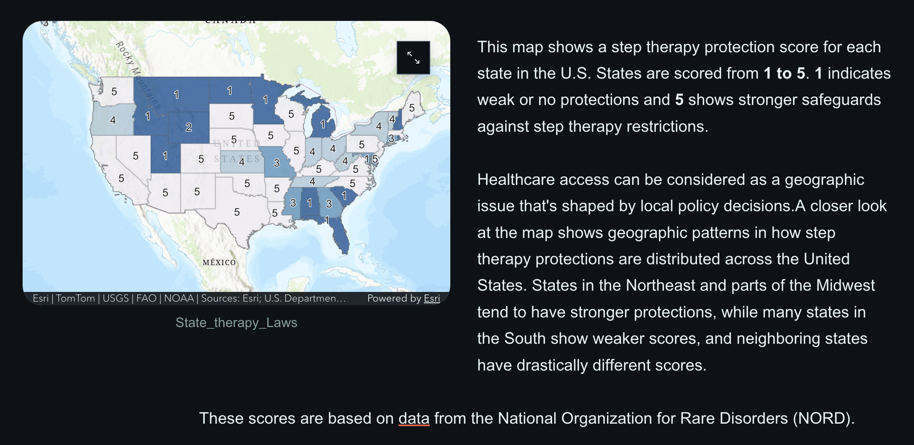
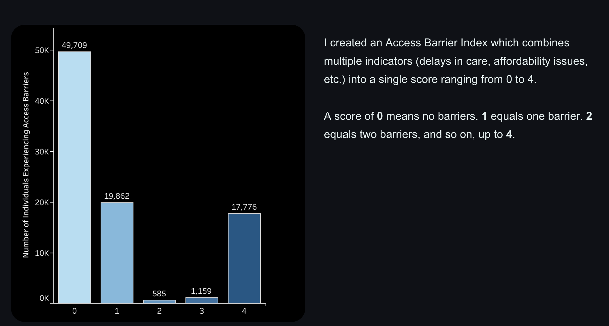
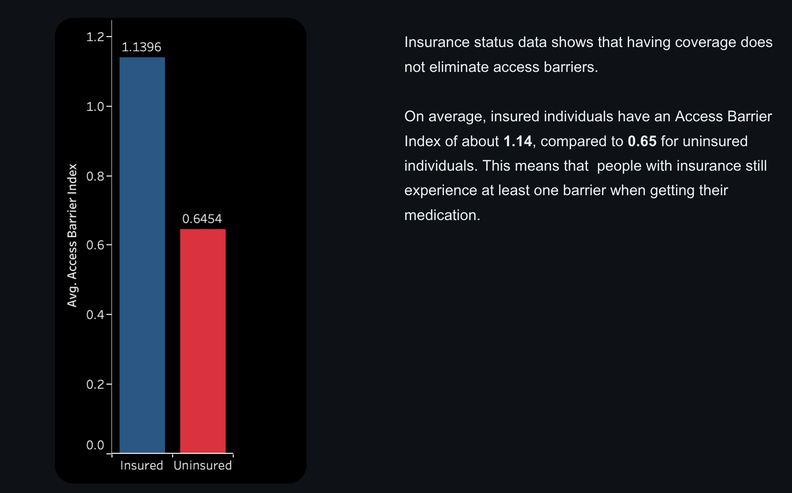
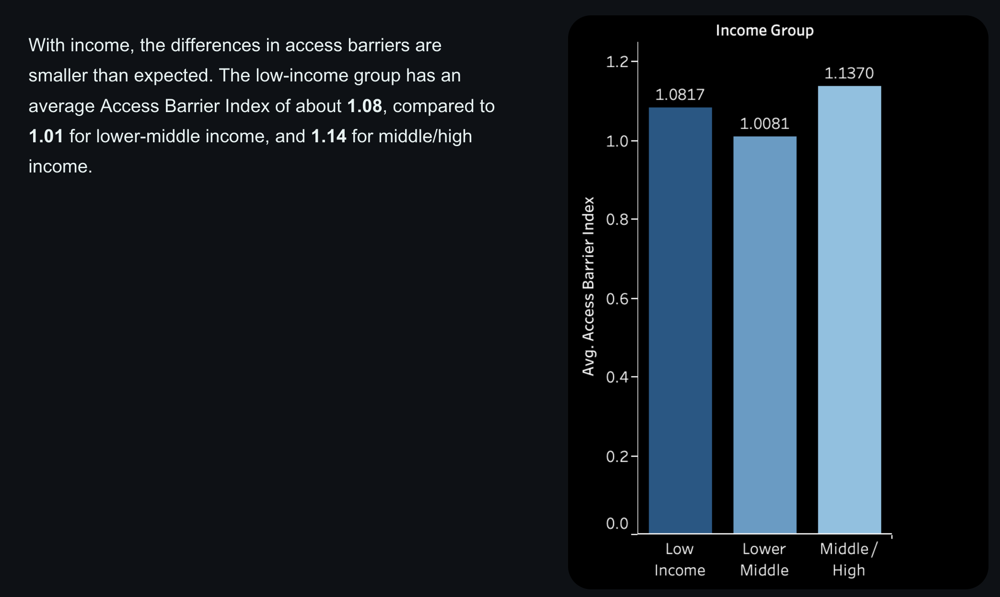

# Insured but Not Protected:
## A Countermapping Analysis of Prescription Access in the U.S.

## Overview
This project examines how insurance policies and structural factors contribute to delays in accessing prescription medication. 
---

## The Problem
Many individuals face delays in obtaining prescription medication, even with insurance. These delays are shaped by income, insurance type, and policy structures.

---

## Policy Landscape: Step Therapy Protections

This map shows step therapy protection scores across U.S. states, ranging from 1 (weak protections) to 5 (strong protections), based on data from the National Organization for Rare Disorders (NORD).

A closer look shows that stronger protections are concentrated in the Northeast, while weaker protections appear more frequently in the South. 

---

## Measuring Access: The Access Barrier Index

The Access Barrier Index captures the number of challenges individuals face when trying to access prescription medication. Scores range from 0 to 4, with higher values indicating more barriers.

---

## Findings

### Insurance Status

Even with insurance, insured individuals still face access barrers. Insurance alone does not eliminate delays in accessing medication.

---

### Income Group

Access challenges are not limited to low-income populations, as barriers exist across other income levels.

---

## Countermapping Insight

This project uses mapping to show where policies exist and instead examines who is affected by them. While the map does not directly display race, it highlights systems that disproportionately impact Black and Brown communities through differences in income, insurance coverage, and geography.

---

## Conclusion
Access to prescription medication is shaped by a combination of policy limitations, structural inequality, and geographic variation. 
